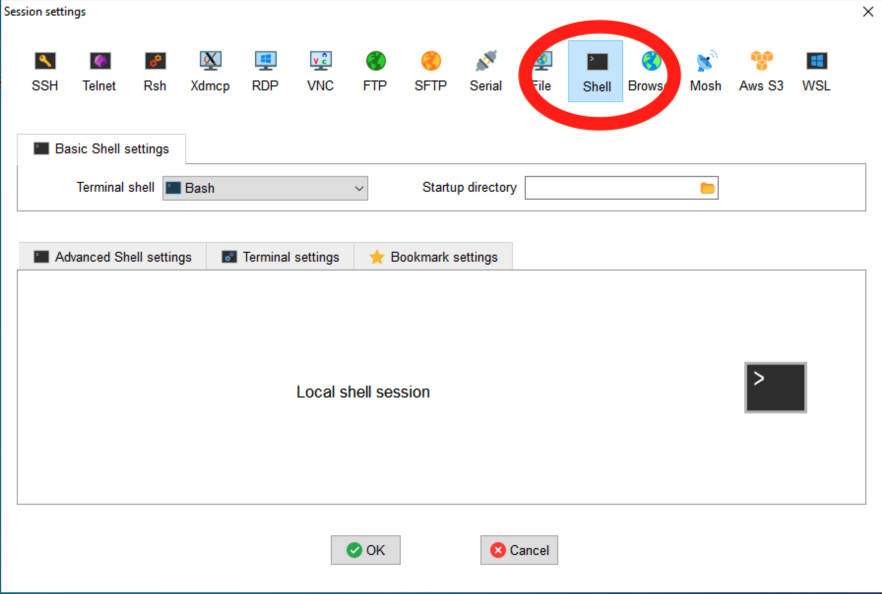
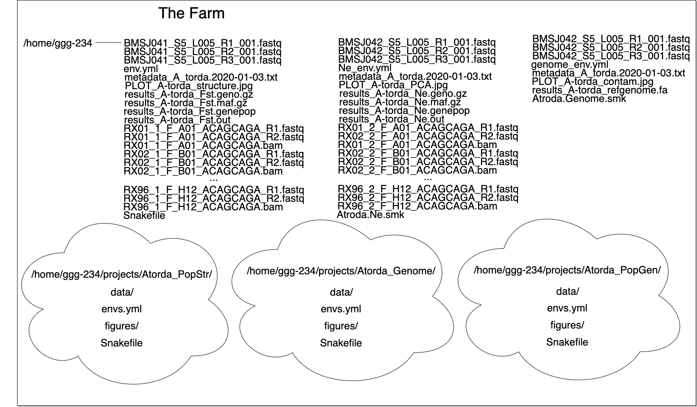

# Structuring your projects for current and future you

[toc]

In this two lab, we will discuss folder structures for
organizing your projects so that you can track inputs, outputs, and
processing scripts over time, and keep yourself organized as your
projects evolve.

This lesson was adopted from [a lesson](https://github.com/ngs-docs/2021-GGG298/blob/latest/Week8-project_organization_and_UNIX_shell/README.md) co-authored by Shannon Joslin for GGG 298 at UC Davis.

## Learning Objectives

By the end of this lesson, students will:

* know how to transfer files around efficiently
* understand how to set up a data-driven project for tracking and proper iteration
* know how to store and work with mass quantities of data
* understand _why_ to setup projects in a specific manner
* begin to plan file and directory names for their own workflows

@@
Before continuing, please:

* be sure that you can log into farm.cse.ucdavis.edu with your datalab-XX account
* do [pre-load some files into your account](connecting-to-remote-computers-with-ssh.html#loading-some-files-into-your-account)

## Transferring files around efficiently

We've spent some time transferring single files around with 'scp', and
hopefully you feel comfortable with that now.  But many people (myself
included) find 'scp' kind of annoying because you have to already know
the path to the filename, and it's kind of inconvenient for transferring
multiple files around.

For this, we're going to make the MobaXterm folk use a shell window:

@@



OK, so what options are there when using 'scp'?

### recursive `scp` with `-r`

First, you can copy entire directories with `scp` by using `-r` --
from your laptop, try doing
```
scp -r datalab-XX@farm.cse.ucdavis.edu:2021-remote-computing-binder/2cities 2cities
```
this will transfer the entire directory to your local computer.

### `sftp`

You can use a command line _within_ a command line with sftp.

Briefly,
```
sftp datalab-XX@farm.cse.ucdavis.edu
```
will open up a "secure file transfer" shell, that has its own set of
commands. Try typing:
```
cd 2021-remote-computing-binder
cd 2cities
ls
get README.md
```
-- I use this quite a bit when I want to be able to use 'cd' and 'ls'
to find the right file to download.

Use `quit` to exit out of SFTP.

### `zip -r` to create collections of files

Zip files work on pretty much all systems, and are handy ways to transport
collections of files.

To create a zip file:

```
cd ~/2021-remote-computing-binder
zip -r 2cities.zip 2cities
```

The file `~/2021-remote-computing-binder/2cities.zip` is now a file
you could copy or transfer around, and it will unpack to the entire
contents of the directory `2cities/`.

To view the contents of a zip file:
```
unzip -v 2cities.zip
```
and to unpack it:
```
cd ~/
unzip 2021-remote-computing-binder/2cities.zip
```
which will create a new directory `~/2cities/`.

### Working with `.tar.gz` files

While I strongly recommend using zip files, you will inevitably run into
.tar.gz files on UNIX. You can think of these as "collections of files that have been glommed into one file and then gzipped", and here are the two commands you need to know:

```
tar tzvf ~ctbrown/2cities.tar.gz
```
will show you the contents of a .tar.gz file, and
```
tar xzvf ~ctbrown/2cities.tar.gz
```
will unpack it into your current directory.

I don't recommend creating .tar.gz files in general so I'm not going
to show you how to create them :).

tar stands for 'tape archive' and is notoriously confusing to use, so I'm
not going to say any more about it.

([Obligatory xkcd on using the tar command.](https://www.explainxkcd.com/wiki/index.php/1168:_tar))

### Probably the most useful advice: use a transfer directory

To me, it's really annoying to find and remember directory paths and
filenames when transferring files around, and I've been doing it for
30 years and am really practiced at it.

So what I sometimes do is use a 'transfer' directory.

On farm,
```
mkdir ~/transfer
cp ~/2021-remote-computing/2cities/README.md ~/transfer/
```
and now (on your laptop) you can just do things like
```
scp datalab-XX@farm.cse.ucdavis.edu:transfer/README.md .
```
and you don't have to remember the full path.

This is handy because you can use your current working directory and things
like tab completion on the remote system to copy files into your transfer
directory, and then remember only a short path to actually transferring files
around.

I use this when I'm working in complicated or annoying directory structures.

## Retrieving remote files from Web sites

Often you want to grab files from Web sites - CSV data sets, text files,
or what have you.

This involves finding the URL, and then using a program like `wget` or
`curl` to get them. We're going to use `curl` today, but `wget` does pretty
much the same thing.

Let's find a URL for the Tale of Two Cities book that we've been using,
over on Project Gutenberg.

Go to this Web site in a browser: https://www.gutenberg.org/ebooks/98

and find the link that says "Plain text". Right click on it, and "copy
link".

Now go back to your terminal window where you're logged into farm, and
run
```
cd ~/
curl -L -O https://www.gutenberg.org/files/98/98-0.txt
```
and this will create a file `98-0.txt` in your current directory.

You can run `head` on this file:
```
head 98-0.txt
```
and see that it contains the right text.

The trick is often to find the right URL to get the raw text link.
For example, if you go to a GitHub link, like

>https://github.com/ngs-docs/2021-remote-computing-binder/blob/latest/2cities/README.md

and you run curl on this you will get the formatted Web file, which isn't
generally what you want.

What you want for GitHub files is the 'Raw' link - try clicking on that.
This is now the text file, and you can use curl on it --
```
curl -L -O https://github.com/ngs-docs/2021-remote-computing-binder/blob/latest/2cities/README.md
```

Note here that the `-L` tells curl to follow Web redirects, which can be important; and `-O` says save the file under the name at the end of the URL. You can omit `-O` and it will send the file to stdout:
```
curl -L https://github.com/ngs-docs/2021-remote-computing-binder/blob/latest/2cities/README.md > new-file.txt
cat new-file.txt
```

**The really nice thing about this is that for _big_ files, the file will
transfer directly between the hosting site and the remote computer.**
This is really handy for e.g. large sequencing data files that are located at
sequencing facility Websites - you don't have to download 100 GB files
to your laptop and then transfer them from there to farm, or into the
cloud, for example! (This is a big reason why cloud computing is really
interesting for the NIH - less data transfer between distant computers for really big data sets!)

Other than finding and copying the right URL, the other tricky thing
that doesn't generalize is permission-restricted files. Briefly, since
you're copying the URL from your browser (where you may be logged in)
over to farm (where you may not be logged in), farm may not have access
to download it. There is no one-size-fits-all solution to this,
unfortunately.

@@
**CHALLENGE:**

- Pick any book from https://www.gutenberg.org/
- Find the URL for the plain text
- Copy the URL
- Use `curl` to download it to farm
- Look at it with `head`

## Dealing with files: some recommendations

Some short-hand rules I recommend for working with files on remote systems.

- download big files directly to remote computer system if possible, so that they don't go via your home/work Internet connection or laptop (which is often more limited than the remote computer's connection!);
- get used to transferring files to/from your laptop (see below); consider using a `transfer/` directory for simplicity;
- for managing small files that you create on a remote system, use version control
- you can also configure Dropbox on Linux systems, but it burdens the system and it's also not a great idea to copy files that are probably private over to a shared system. I've also had some bad experiences with deleting my entire Dropbox by mistake... UNIX makes it a little too easy to operate on lots of files!

## Farm vs cloud

One of the main differences that you'll see over time is that there
are "remote, shared" systems like farm, and "remove, private" systems
like binder and Amazon/Google cloud computers. The cloud computers
often _guarantee_ you resources and some level of privacy along with
superuser privileges, but also charge you for it (and it's often
inefficient use of compute!) By contrast, "remote, shared" systems
like HPCs and shared workstations can provide larger resources at the
cost of sometimes having to worry about what other users are doing.

The "ride share" vs "personal car" analogy is fairly apt here,
actually :).  In shared cars, you have to worry about where other
people want to go and accomodate them at least sometimes, but you can
share purchase and maintenance costs. With personal cars, you bear
the entire cost burden, but you don't have to coordinate with other
people much.

There are no simple answers as to what system to use, but I feel
confident in asserting that if you have access to a shared compute
cluster, you should start there and only consider expanding into the
cloud once you know your needs.

## Thinking about data science projects!

The next sections all talk about configuring your data and directories
so that you can track your work.

This is because, fundamentally, we use computers to first _explore_ data
sets, before refining and producing.

@@


So we need to organize our projects for iteration, dead-ends, and
tracking processes over time - potentially months, or years. And that's
what the next few sections will be about.

For more discussion and details, I highly recommend
[Principles for data analysis workflows, Stoudt et al., 2021](https://journals.plos.org/ploscompbiol/article?id=10.1371/journal.pcbi.1008770), which is the best exploration of real data science practice I've yet seen. (Conflict alert: I was a reviewer :)

## One example: a rough bioinformatics workflow

@@


## Sending and Receiving Data

Here at UC Davis most researchers sequence at the UC Davis [DNA Technologies Core](https://dnatech.genomecenter.ucdavis.edu/). You can find their sample submission form [here](https://dnatech.genomecenter.ucdavis.edu/sample-submission-scheduling/).

When they've sequenced your samples they will hold your sequencing data on either [SLIMS lab information management system](https://slims.bioinformatics.ucdavis.edu/) for three months after the sequencing run finishes or [bioshare](https://bioshare.bioinformatics.ucdavis.edu/) for an undetermined amount of time. Do yourself a favor and download & back your new sequencing data up to a hard disk IMMEDIATELY.


### Downloading data - is it correct?

We'll be grabbing some from [OSF](https://osf.io/), an open science framework that can host small amounts of data (5Gb limit).

Let's setup a directory to work from and download some data:

```
mkdir -p ~/seqdata
cd ~/seqdata
curl -L https://osf.io/srdhb/download -o mini_Alca-torda.tar.gz
tar -xvf mini_Alca-torda.tar.gz
cd mini_A-torda
ls -alh
```

And we should see a list of _Alca torda_ chromosomes.

We got some data! However, the data could have been changed or corrupted in the process of downloading it from the Internet. (This CAN happen, and WILL happen if you do this for long enough!)

We can address this problem by using the `md5sum` command. [md5sum](https://en.wikipedia.org/wiki/Md5sum), in short, is a command that spits out a string of characters to represent a file's fingerprint. If a file with the same name has characters that are different the md5sum will show the difference, so we don't have to find the difference. This is exceptionally valuable when we have files that contain gigabytes of data.

Let's see what an md5sum looks like:
```
md5sum mini-chr1.fna.gz
```

you should see something exactly like:

> d34e2c570ef79195dfb56b8c258490f8  mini-chr1.fna.gz

Here you can see a string of characters that represent the `mini-chr1.fna.gz` md5sum. The first string of characters is the file's "fingerprint". The second is the name of the file--this is  useful when we md5sum multiple files.

If you change even a single byte of the file, the md5sum fingerprint will change _completely_.

So, We can check to make sure the data downloaded successfully by seeing if the string of characters generated by md5sum matches the ones in the `@mini_A-torda.md5` file.

First, take a look at the file:

```
less \@mini_A-torda.md5
```
(press <kbd>Q</kbd> to exit)

We can _check_ a list of md5sums contained in a file with the `-c` flag. The command will automatically look for files contained in the list and check the md5sum against the ones printed in the file.

```
md5sum -c \@mini_A-torda.md5
```

But if we navigate into the `data/` directory we can see there is a `mini-chr1.fna.gz` file there too. Are they the same?

@@
**CHALLENGE:** Determine if the two `mini-chr1.fna.gz` files are the same.

---

Anytime you download large data files you should check to make sure it
has downloaded successfully. In bioinformatics, this includes raw
sequence data from a sequencing center, data from collaborators host
on a shared space, sequence files from NCBI, transferring data between
devices, downloading data from clusters and so on and so forth. (Most
sequencing centers will automatically provide md5sums with your
data. If they do not, email to request them!)

This holds true for other files as well - always be alert to the
possibility of data corruption! Sometimes this can be as innocuous as
"all the line endings in my CSV file are changed because someone
opened and saved it in a different text editor"; sometimes it can be
much worse, as when [Excel started automagically changing gene names
like "Oct-8" into
dates](https://www.theverge.com/2020/8/6/21355674/human-genes-rename-microsoft-excel-misreading-dates)...

We can also make a list of md5sums for a group of files:

```
cd ~/seqdata/mini_A-torda
md5sum mini-chr[1-9]*.fna.gz  >> autosomes.md5
```

Here, we've redirected the output of the `md5sum` command to the `autosomes.md5` file. We can then host/send our data with the md5 file for others to ensure the recipients know they've received the same data.

## Storing data

In any data analysis, we're going to end up producing a lot of intermediate
files. Which ones do we need to save? And how big are they?

The answers will vary depending on workflows. For bioinformatics (and
potentially a range of other data types - your mileage may vary!) we
suggest the following:

### Bioinformatics: What do I back up?

* **raw data** -- YES -- you only get them once!
* **results files** -- YES -- they are so useful
* **intermediate files** -- maybe -- they can be used in many different ways

That having been said, a lot of what we'll show you over the next few
workshops is how to regenerate your intermediate files when you need
them, and/or keep them up to date.

### Bioinformatics: How big should I expect the files to be?

* **Raw data** will probably be the biggest
* **Results files** depends on what you are doing
* **Metadata** are usually pretty small
* **Intermediate files** are usually smaller than your raw data files but there will be _a lot_ of them 

Always, always back up **raw data**. Once the sequencing center deletes the data, it is gone forever!

As such, make sure you've have your data backed up. As soon as you download onto the cluster back it up to another device (or two!).

After you've finished your project you'll probably have some pretty valuable **results files**. Back these up! It is likely that these files won't be nearly as large as our original files and they can often be put on osf.io or downloaded to a laptop.

Examples:

| file type | size | # of files| Total Space |
| -------- | -------- | -------- |-------- 
| Raw Genome Assembly sequencing files| 44Gb | 2 | 88Gb |
| Intermediate files | 12Gb | 2 | 24Gb |
| Assembled Genome | ~550Mb | 1 | 55Mb |
| Raw RAD seq data| 92Gb | 2 | 184Gb |
| Intermediate files from RADseq | ~25Mb | 20,925 | 741Gb |
| Results of PopGen expt | 9.3Mb  | 2 | ~20Mb |

Data files will come in a variety of sizes. In general, the largest single files will be the raw data files you receive from the sequencing center. Individual files in each subsequent step will be smaller (but there might be more of them!) because each step throws out or compresses data. 

However, new files are generated at most steps in most projects. Because of this, the sheer number of intermediate files can take up a lot of space!

### How often should I backup my data?

**Scripts and code:** This varies person to person. I suggest posting your scripts to GitHub and to push to GitHub _at least_ everyday you modify your scripts.  GitHub will give you free private repositories as an academic, so you don't need to make things public.

**Raw Data:** Luckily, you'll only need to backup your raw data once. Or maybe twice. Just don't delete it!

**Results:** Again, these only need to be backed up once. However, if you reanalyze your data make sure you save the new results. Or at least the workflow you used to get there.

### Where do I back up my data?

There are a number of places you _can_ backup to, for better or for worse. 

_**Small amounts of data (< 100 MB)**_ that you would like version controlled, such as code, can be backed up to GitHub.  Note that GitHub is not archival and cannot be used as the permanent post-publication place for your scripts, but there are solutions for that (search "github zenodo").

_**Small amounts of data  (100 Mb - 5Gb)**_ can be stored on a project by project basis at the [Open Science Framework](https://osf.io/). Each project is allocated 5Gb of space and there is no limit on number of projects. OSF also supports private and collaborative projects, and can be referred to in publications, so you can use it as your "raw results" location too.

_**Large amounts of data (> 5Gb)**_ The most reasonable solution to this is to back data up to a (or multiple) hard drives! Data can be stored via your Google Drive account. To store data using storage space that UC Davis has allocated to you, see this [Meet & Analyze Data tutorial](https://mad.oxli.org/t/2019-11-13-how-to-backup-data-on-a-remote-computer/82). 

-------------------------------

## Where do I work with large amounts of data?

### High Performance Computing Clusters 
aka clusters (or HPCs).

UC Davis has a number of clusters available to students, depending on your department or where your lab has purchased resources:

* farm
* crick
* barbera

**Pros:**

- maintained on campus
- help desk for troubleshooting

**Cons:**

- requires an initial buy in to get a significant amount of space & compute

### Amazon Web Service

These are cloud computing services provided by Amazon (what don't they provide!?)
**Pros:**

- Only pay for what you use
- Can have temporary access to supercomputers which _could_ end up costing less than consistent access on a cluster
- great for short-term massive compute needs, if you have the $$

**Cons:**

- no long term storage...unless you want to pay for that too
- must build everything yourself
- no help desk
- have to pay for downloading ("egress charges")

All platforms have pluses and minuses. The one that will work best for you depends on your lab. I prefer the farm, for ease of use & consistency, if your lab can support you. 

## Setting up your project

**QUESTION** Imagine you are at the end of a project, about to write
up the manuscript. Looking back over carrying out your
experiment(s), what were the top 3-5 most useful things to getting
to the point of writing up? And how can you communicate those to future
you (and others)?

### Things to think about

* multiple projects
* inputs and outputs
* directory structure
* testing analyses

In bioinformatics, _organization is everything_. It allows us to be efficient in setting up experiments, maintain consistency between experiments and, in some cases, repeat a previous analysis.

Here we can see how organization allows for a tidy workspace:

@@


The list of files up top isn't too cringe worthy if you only have one project. But multiple projects or experiments in one directory results in an organizational disaster...

@@



@@

I like to have the following directory structure:


## Naming files

Having files with consistent names allows us to do things to them en masse and can also allow us to know what has been done to them. Everyone has a different strategy in what they like their file names to contain and how they go about naming them but here a few suggestions.

#### Prefixes

Use the beginning of your file to your advantage. If you've sequenced individuals yourself, you can name these files according any or all of the following:

* which **individual** they are from
* what **well** in the plate they came from
* the **barcode/tag/library** they have/were a part of
* the **date** of sampling
* which **cohort** they are a member of

An example of this might be something like `Ht_1997_A08_21_ACTGTT.fastq`
where:

* Ht = species ID (Hypomesus transpacificus)
* 1997 = birth year
* A08 = well number
* 21 = plate number
* ACTGTT = associated barcode

Having some metadata in the file name can allow for efficient groupings when running quality controls (such as testing for batch effects).

If we keep our names consistent between plates/runs could run an
analysis on all individuals that were from any of these variables.

And, as a reminder, with tab completion, long and ugly file names are
not really a problem to type!

#### File endings

The ends of files can be immensely helpful as well. Remember, at the
command line, a file's ending (e.g. `.txt` or `.csv`) exists to inform
a human what kind of file/format to expect. 

## Additional resources
* [Bioinformatics Data Skills](http://vincebuffalo.org/book/) by Vince Buffalo 
* [Best Practices for Sci Comp](https://journals.plos.org/plosbiology/article?id=10.1371/journal.pbio.1001745) (Wilson et al. 2014)
* [Bioinformatics Curriculum Guidelines](https://journals.plos.org/ploscompbiol/article?id=10.1371/journal.pcbi.1003496) (Welch et al. 2014)

----

# Automating your analyses and executing long-running analyses on remote computers

This part of the lab will show you how to automate their
analyses using shell scripts, as well as run and manage software that
takes minutes, hours, or days to execute. We’ll also remind you how to
disconnect from and resume running processes using the ‘screen’ and 'tmux'
commands.

This lesson was adapted from [a lesson](https://github.com/ngs-docs/2021-GGG298/tree/latest/Week8-project_organization_and_UNIX_shell#file-manipulation) co-authored by Shannon Joslin for GGG 298 at UC Davis.

Learning objectives:

- Commands `for`, `basename`, `echo`, `if`
- How to write and execute shell scripts
- Learning how to use multiple sessions with screen for long-running analyses

## What is a script?

A script is like a recipe of commands for the computer to execute. We're teaching you how to make shell scripts today, but scripts can be in any programming language (R, python, etc.).

Why and when would we want to use scripts vs. typing commands directly at the terminal?

   - Automate: don't have to remember all the commands and type then one at a time
   - Scale up: can use same script for multiple samples, multiple processes
   - Reproduce & share: easier to reproduce or share analyses because it's all written down
   - Version control: place text files in version control systems like git!

Note that scripts are especially helpful for processing many files with the same commands - but sometimes it's not always worth the time/effort for an uncommon task. See [xkcd comic](https://xkcd.com/1205/) - is it worth the time? :)

## Automating commands by putting them in a text file

### Running scripts with `bash`

At the terminal, we can type:
```
echo Hello, this is the terminal!
```

Create a script file with nano - The file extension for shell scripts is '.sh'.
```
nano first_script.sh
```

Add the following 3 lines to the script:
```
#!/bin/bash
echo Hello, this is a script!
echo I am on the next line!
```

The `#!/bin/bash` header (this is known as a "[sha-bang](https://en.wikipedia.org/wiki/Shebang_(Unix))" or hashbang) tells the shell how to interpret the script file.  It will be used later!

Execute the script
```
bash first_script.sh
```

Note that commands are executed in the order that they appear in the script


## `for` Loops

Scripts can do far more than print echo statements! We're gonna take a detour to learn about for loops and then run loops in scripts.

Above, we showed you a way to create a list of the md5sum numbers for the autosome files:
```
cd ~/seqdata/mini_A-torda

md5sum mini-chr[1-9]*.fna.gz  >> autosomes.md5
```

This approach uses wildcards to tell the shell to grab the md5sum for all files starting with `mini-chr`, with a number from 1 to 9, and ending with '.fna.gz'. Another way to do this, and include the Z chromosome file as well, is to write a for loop that runs the `md5sum` command for each '.fna.gz' file in the directory:

(To type this in the terminal, type 'enter' or 'return' after each line)
```
for i in *.fna.gz
do
   echo md5sum $i
done
```

**QUESTION:** why did we put `echo` here?

Another way to enter the for loop code into the terminal uses `;`:
```
for i in *.fna.gz; do echo md5sum $i; done
```

for loop structure:

- we set the counter for the thing we want to iterate ("loop") through with the `for i in *.fna.gz`. In this case, we are running the same command for each file in our current directory that ends in '.fna.gz'. The `i` represents the ith file in our loop and we refer to it with the `$` notation (more on variables later!) - also, "i" is an arbitrary name; it could be "potato" :)
- starts with `do` and ends with `done`
- loop components are separated by `;` or new lines.

*We have used indentation to make it easier to read the for loops in the notes, but the shell does NOT need indentation to interpret the loop! Note that other programming languages like Python do require indentation!*

Now, let's append those md5sum numbers to a text file
```
for i in *.fna.gz; do md5sum $i >> my_md5sum_list.txt; done
```

**Reminder:** The `>>` are appending the md5sum values to 1 text file.

Check out the list (exit by pressing q)
```
less my_md5sum_list.txt
```

Now, let's practice for loops by renaming MiSeq sequence file names - we're going to build a for loop step by step. Go to this directory: `~/2021-remote-computing-binder/data/MiSeq`:
```
cd ~/2021-remote-computing-binder/data/MiSeq
```

and then type

```
for i in *.fastq
do
   echo $i
done
```

This is running the command `echo` for every value of the variable `i`, which is set (one by one) to all the values in the expression '*.fastq'.

If we want to get rid of the extension '.fastq', we can use the `basename` command:

```
for i in *.fastq
do
   basename $i .fastq
done
```

Now, this doesn't actually rename the files - it just prints out the name, with the suffix '.fastq' removed.  To rename the files, we need to capture the new name in a variable:

```
for i in *.fastq
do
   newname=$(basename $i .fastq).fq
   echo $newname
done
```

What `$( ... )` does is run the command in the middle, and then replace the `$( )` with the output of running the command. This output is assigned to the variable "newname".

*Side note:* you may see backticks used instead of `$(...)`. It does the same thing but the syntax is trickier to get right, so we teach `$(...)` instead of `` `...` ``. Note that `$( ... )` can be nested, to, so you can do `$( command $( command2 ))` which is occasionally handy.

Now we have the old name (`$i`) and the new name (`$newname`) and we're ready to write the rename command --

```
for i in *.fastq
do
   newname=$(basename $i .fastq).fq
   echo mv $i $newname
done
```

@@
**CHALLENGE:** Run the above loop in a shell script called `rename_file.sh`.


Now that we're pretty sure it all looks good, let's run it for realz - the shell script should look like this:

```
#!/bin/bash

for i in *.fastq
do
   newname=$(basename $i .fastq).fq
   mv $i $newname
done
```


### Subsetting

Let's do something quite useful - subset a bunch of FASTQ files.

If you look at one of the FASTQ files with head,

```
head F3D0_S188_L001_R1_001.fq
```

you'll see that it's full of FASTQ sequencing records.  Often I want to run a bioinformatics pipeline on some small set of records first, before running it on the full set, just to make sure all the syntax for all the commands work ("data forensics"). So I'd like to subset all of these files *without* modifying the originals.

First, let's make sure the originals are read-only

```
chmod u-w *.fq
```

Now, let's make a 'subset' directory

```
mkdir subset
```

Now, to subset each file, we want to run a 'head' with an argument that is the total number of lines we want to take.  In this case, it should be a multiple of 4, because FASTQ records have 4 lines each. Let's take the first 100 records of each file by using `head -400`.

The for loop will now look something like:

```
for i in *.fq
do
   echo "head -400 $i > subset/$i"
done
```

**QUESTION:** We need to use `" "` for the echo statement above - why?

If that command looks right, run it for realz:

```
for i in *.fq
do
   head -400 $i > subset/$i
done
```

and voila, you have your subsets! We can check the number of lines for all the subset files:
```
wc -l ./subset/*
```

(This is incredibly useful. You have no idea :)

@@
**CHALLENGE:** Can you rename all of your files in subset/ to have 'subset.fq' at the end?

### Variables

Let's backtrack a bit - what are variables?

We've seen 2 examples of variables so far - `$i` and `$newname`:
```
for i in *.fastq
do
   newname=$(basename $i .fastq).fq
   mv $i $newname
done
```

You can use either $varname or ${varname}.  The latter is useful when you want to construct a new filename, e.g.

```
MY${varname}SUBSET
```

would expand ${varname} and then put "MY" and "SUBSET" on either end, while

```
MY$varnameSUBSET
```

would try to put "MY" in front of $varnameSUBSET which won't work - unknown/uncreated variables are evaluated to empty by default, so this would just expand
to `MY`.

We recommend always using `${name}` instead of `$name`, because it
always works the way you expect, unlike `$name`, which can be
confusing when constructing new filenames as above.

NOTE: `${varname}` is quite different from `$(expression)`! The former is replaced by the value assigned to `varname`; the latter is replaced by the result of running `expression`. So, both *replace* but they do different things. Think of `$` here as meaning, "replace me with something".

## Troubleshooting scripts

As we've seen above, the `echo` statements help to make sure the commands look correct before running for real.

There are several `set` options that are useful to determine what happens to your script on failure. We recommend:

- Always put `set -e` at the top.
- Sometimes put `set -x` at the top.

### Practicing `set -e` in bash scripts

1. We're going to use the MiSeq .fq files again. Create an output report directory
```
cd ~/2021-remote-computing-binder/data
mkdir ./MiSeq/fastqc_reports
```

2. Create and activate a conda environment that has `fastqc` installed in it:

```
mamba create -n fqc -y fastqc
conda activate fqc
```

3. Write a for loop that runs fastqc on each .fq files with a shell script. Create a bash script using nano text editor (save and exit with CTRL-O, enter, CTRL-X on keyboard)
```
nano set_e.sh
```

Create a bash script with the following commands, this version includes `set -e`:

```
#!/bin/bash

set -e

OUTDIR='fastqc_reports'

for i in ./MiSeq/*.fq
do
   echo $i
   fastqc $i -o $OUTDIR
done
```

**Reminder:** Another way to type bash `for` loops is with the `;`, for example this syntax does the same thing as above:

```
for i in ./MiSeq/*.fq; do echo $i; fastqc $i -o $OUTDIR; done
```

This command runs the script:

```
bash set_e.sh
```

@@

**CHALLENGE**

1. What happens when you run the bash script above **with** and **without** the `set -e` option?
2. There is an error in the bash script. How would you fix the script? (Bonus: try adding `set -x` to your bash script)


## If statements

If statements act on things conditionally. For example, you might want to do something if a file exists and a different thing if the file doesn't. In other words, if statements evaluate outputs as True or False and use the output to decide what action to take - it's like a decision tree.

(Note that [conditional operators in Unix](https://www.tutorialspoint.com/unix/unix-basic-operators.htm) are not all the same as in other programming languages)

`if` statement structure:

- starts with `if` and ends with `fi`
- loop components are separated by `;` or indentation

Here, we're wrapping if statements in a for loop:  

```
cd ~/
nano if-for.sh
```

Put this loop in the `if-for.sh` script file:
```
for i in *
do
   if [ -f $i ]; then
      echo $i is a file
   elif [ -d $i ]; then
      echo $i is a directory
   fi
done
```

(the version of above loop that uses the `;` separators)
```
for i in *; do if [ -f $i ]; then echo $i is a file; elif [ -d $i ]; then echo $i is a directory; fi; done
```

but what the heck is this `[ ]` notation? That's actually running the 'test' command; try `help test | less` to see the docs. This is a weird syntax that lets you do all sorts of useful things with files -- I usually use it to get rid of empty files.

```
touch emptyfile.txt
```

to create an empty file, and then:

```
for i in *
do
   if [ \! -s $i ]; then
      echo rm $i
   fi
done
```

...and as you can see here, I'm using '!' to say 'not'. (Why do I need to put a backslash in front of it, though??)

(`-s` tests if a file exists and is not empty)

### Running scripts in a loop

We can run loops in scripts AND scripts in loops!

Say we have an `ifs.sh` script that compares 2 numbers with an if statement:

```
#!/bin/bash

a=40
b=20

if [ $a != $b ]
then
  echo 'a is not equal to b!'
else
  echo 'a is equal to b!'
fi
```

Run the script:
```
bash ifs.sh
```

**QUESTION:** What does the `!=` conditional operator mean?

Now, let's edit this script to give it arguments. Instead of editing the values for "a" and "b" in the script, we'll create "a" and "b" arguments so we can change them when executing the script.

Here's how we change the script - `$` and the number assigns the argument a position in the line of code.

```
#!/bin/bash

a=$1
b=$2

if [ $a != $b ]
then
  echo 'a is not equal to b!'
else
  echo 'a is equal to b!'
fi
```

After the `bash <script name>`, the syntax now assigns the 1st element (`$1`) to `40` and the 2nd element (`$2`) to `20`. This means you can enter different numbers when executing the script, without needing to edit the script file at all!

```
bash ifs.sh 40 20
```

Note, you can add `echo` statements to the script to remind you what the arguments are. This is often helpful for troubleshooting and building the script, for example:
```
#!/bin/bash

echo running $0
echo a will be $1
echo b will be $2

a=$1
b=$2

if [ $a != $b ]
then
  echo 'a is not equal to b!'
else
  echo 'a is equal to b!'
fi
```

@@

**CHALLENGE:** How might you use this script in a for loop to compare a range of numbers to one number? For example, suppose you wanted to check the $2 parameter against the numbers `20 30 40 50 60 70` to see if it matched one of them?


## Persistent sessions with screen and tmux

What if you want to run multiple scripts at once, or you want to put your computer to sleep to check later without stopping analyses that take a long time to complete?

There are two programs, `screen` and `tmux`, that allow you to create separate terminal screens that can continue to run in the background (as long as you don't turn your computer off!). If you're running these programs on the Farm, you can logout and even turn your computer off. :) We'll get back to these details in workshop 10, [Executing large analyses on HPC clusters with slurm]. These are a bit tricky to get used too, so we'll do a demo.

Basic command-line commands for `screen` and `tmux` are listed below. They both have many keyboard shortcuts as well ([screen cheat sheet](https://training.nih-cfde.org/en/latest/General-Tools/Cheat-Sheets/screen_cheatsheet.html)).

Description | screen | tmux
--- | --- | ---
start a screen session | `screen -S <session name>` | `tmux new -s <session name>`
close a session | `screen -d <session name>` | `tmux detach`
list existing sessions | `screen -ls`  | `tmux ls`
go to existing session | `screen -r <session name>` | `tmux attach -t <session name>`
end session | `exit`  | `tmux kill-session -t <session name>`

Like text editors, both programs basically do the same thing - choose the one you're most comfortable using!

There are several reasons to use screen or tmux --

* they keep output from long-running commands, including ones that are running interactively and need input;
* they provide a way to "detach" from a particular shell prompt with a particular configuration, and resume it later;
* they let you switch between terminal windows that are running on two different computers.

One last note - per [Configuring your account on login] from workshop
4, 'screen' and 'tmux' start new shells, but they are not login
shells.  So `.bash_profile` is not run inside of screen/tmux sessions,
but the configuration file `.bashrc` is.  Of course, you can always
execute the commands in `.bash_profile` by running `source ~/.bash_profile`!

## Concluding thoughts

* Break the task down into multiple commands
* Put commands in shell scripts, run in serial
* Automate and scale up using for loops and conditional statements
* Use `echo` and `set -e` to debug!

## Appendix: exercise answers

*Answers for questions*

Why do we use `echo` in for loops?

- `echo` prints out the command without running it; this is a good way to double-check the for loop is doing what you expect!

Why did we need " " in the subset `echo` statement for loop?

- In this case, the shell will evaluate the `echo` statement as everything in the double-quotes. Without the quotes, the echo statement will send "head -400 $i" to a file in the `subset` directory; it will not run the subset command properly.

What does the `!=` conditional operator mean?

- This means "not equal to". The "!" means "not". Whereas, "==" means "equal to".

*Answer for subset exercise*
```
for i in *.fq; do echo "head -400 $i > subset/$i"; newname=$(basename $i .fq)subset.fq; echo mv subset/$i subset/$newname; done
```

*Answers for `set -e` exercises*

1. Fails on 1st iteration with `set -e`, fails each iteration of the loop without `set -e`

Output with `set -e`:

```
(base) ~$ bash set_e.sh
./MiSeq/F3D0_S188_L001_R1_001.fq
Specified output directory 'fastqc_reports' does not exist
```

Output without `set -e`:

```
(base) ~$ bash set_e.sh
./MiSeq/F3D0_S188_L001_R1_001.fq
Specified output directory 'fastqc_reports' does not exist
./MiSeq/F3D0_S188_L001_R2_001.fq
Specified output directory 'fastqc_reports' does not exist
./MiSeq/F3D141_S207_L001_R1_001.fq
Specified output directory 'fastqc_reports' does not exist
./MiSeq/F3D141_S207_L001_R2_001.fq
Specified output directory 'fastqc_reports' does not exist
...
```


2. Add `set -x` option to print out the commands computer is running. There's an error in the path to save FastQC output reports.

```
# wrong path
OUTDIR='fastqc_reports'

# correct path
OUTDIR='./data/fastqc_reports'
```

*Answer for ifs.sh in a loop exercise*

This is one approach to compare 20 30 40 50 60 70 to the $2 argument:
```
for i in 20 30 40 50 60 70
do
   bash ifs.sh $i 40
done
```

This output (including the helpful `echo` statements), looks like this:
```
a will be 20
b will be 40
a is not equal to b!
a will be 30
b will be 40
a is not equal to b!
a will be 40
b will be 40
a is equal to b!
a will be 50
b will be 40
a is not equal to b!
a will be 60
b will be 40
a is not equal to b!
a will be 70
b will be 40
a is not equal to b!
```

This is one approach to compare a range of numbers to the $2 argument:
```
for i in {1..5}
do
   bash ifs.sh $i 5
done
```

The output (including the helpful `echo` statements) will look like this:
```
a will be 1
b will be 5
a is not equal to b!
a will be 2
b will be 5
a is not equal to b!
a will be 3
b will be 5
a is not equal to b!
a will be 4
b will be 5
a is not equal to b!
a will be 5
b will be 5
a is equal to b
```
